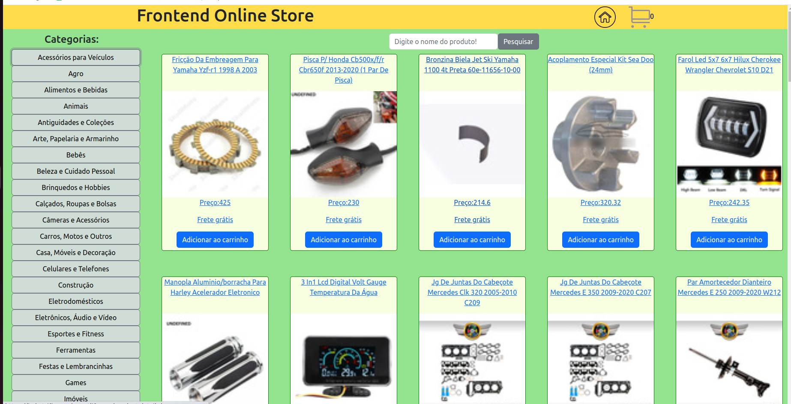

# Getting Started with Create React App

This project was bootstrapped with [Create React App](https://github.com/facebook/create-react-app).

## PROJETO REALIZADO EM GRUPO, ONDE PODEMOS TER UMA EXPERIÊNCIA REAL DE CONSTRUÇÃO MERGIANDO OS COMMITS
- `Projeto realizado enquanto estudante da Trybe`

In the project directory, you can run:
# 🛠️ Abrir e rodar o projeto
 
 https://jade-trifle-9cc2b8.netlify.app/

### `npm start`

Runs the app in the development mode.\
Open [http://localhost:3000](http://localhost:3000) to view it in your browser.

### `npm install`
- Baixar as dependencias do projeto

### `imagem de uma das telas de pesquisa:`

 

### `npm run build` fails to minify

This section has moved here: [https://facebook.github.io/create-react-app/docs/troubleshooting#npm-run-build-fails-to-minify](https://facebook.github.io/create-react-app/docs/troubleshooting#npm-run-build-fails-to-minify)
